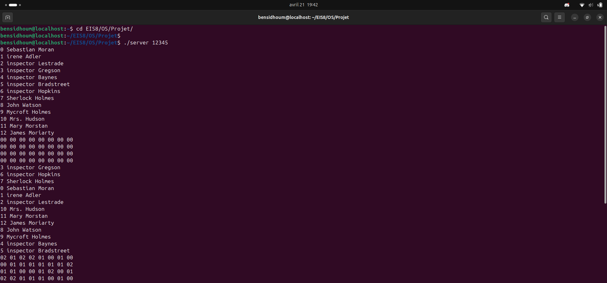
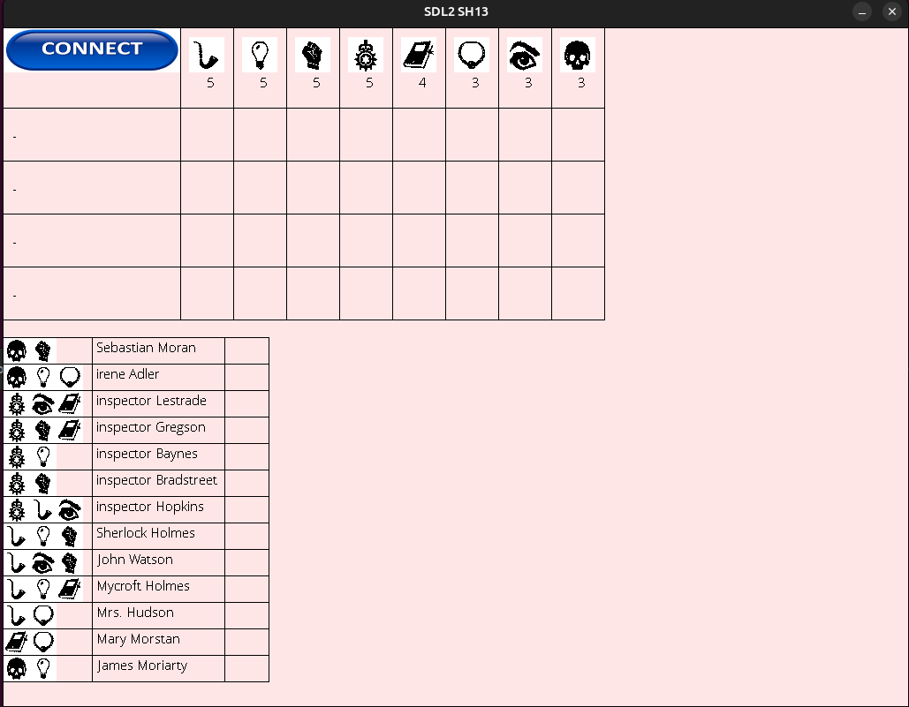
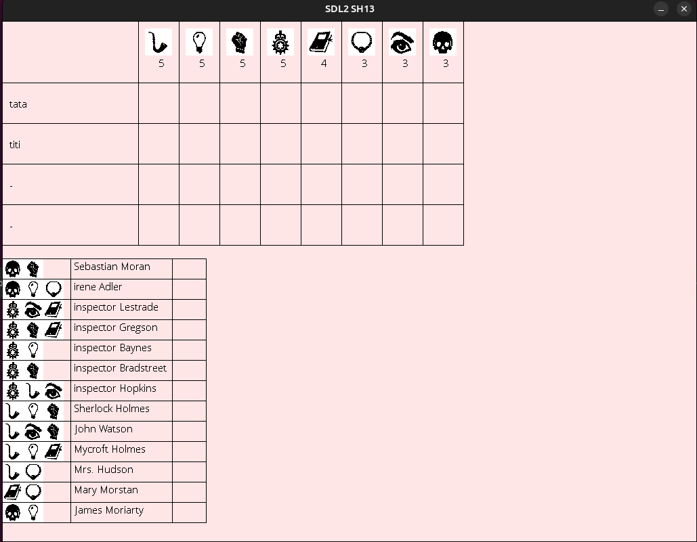
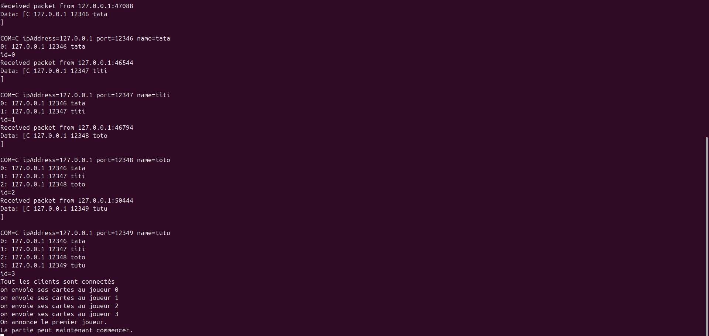
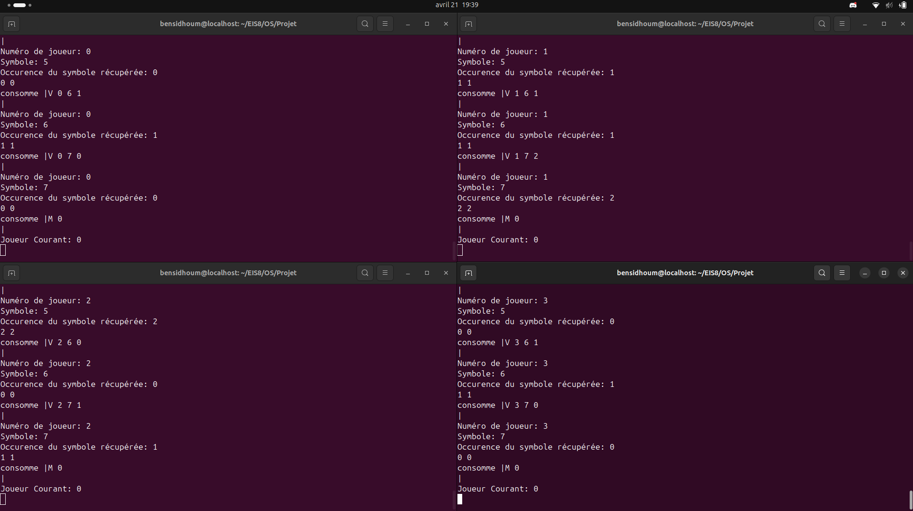
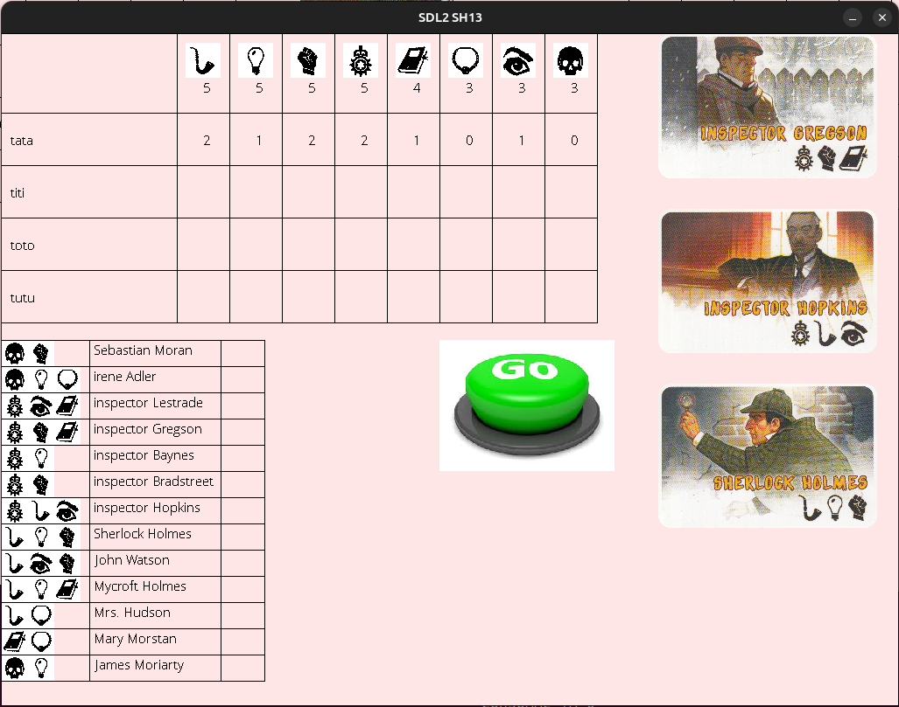

# Projet OS USER: Sherlock 13

## Introduction
Sherlock 13 est un jeu de déduction à 4 joueurs. 
Chaque joueur se voit attribuer 3 cartes Personnages parmi 13 cartes, chacune possédant 2 ou 3 symboles: 
- Sebastian Moran: Crâne, Poing; 
- Irene Adler: Crâne, Ampoule, Collier; 
- Inspector Lestrade: Couronne, Oeil, Carnet; 
- Inspector Gresson: Couronne, Poing, Carnet; 
- Inspector Baynes: Couronne, Ampoule; 
- Inspector Bradstreet: Couronne, Poing; 
- Inspector Hopkins: Couronne, Pipe, Oeil; 
- Sherlock Holmes: Pipe, Ampoule, Poing; 
- John Watson: Pipe, Oeil, Poing; 
- Mycroft Holmes: Pipe, Ampoule, Carnet; 
- Mrs. Hudson: Pipe, Collier; 
- Mary Morstan: Carnet, Collier; 
- James Moriarty: Crâne, Ampoule. 

Parmi ces 13 cartes, seulement 12 sont distribuées: la 13e est donc la coupable. 
Pour le trouver, il faudra poser des questions aux autres joueurs afin de déterminer les symboles qu'ils possèdent: 
- "En combien d'exemplaire possèdes-tu ce symbole ?" à un joueur; 
- "Quels joueurs possèdent ce symbole ?" à tout le monde;  

L'idée est donc de tenter de deviner la carte Personnage manquante à partir des symboles distribuées en jeu et des renseignements obtenus par soit et par les autres joueur.  

Une bonne réponse offre la victoire, tandis qu'une mauvaise réponse élimine le joueur (il doit quand même répondre aux questions des autres joueurs). 


--- 


## Implémentation 


### Explication brève du code 

L'implémentation du jeu se base sur un système de communcation client-serveur, où le protocole de communication utilisé est le TCP. 

Le projet se compose alors de deux codes C: server.c et sh13.c. 
- **`server.c`**: 
Il communique avec les 4 clients et s'occupe de gérer l'état du jeu en fonction des requêtes des clients ainsi que des réponses qu'il envoie. 
Celui-ci fonctionne suivant 2 états grâce à la variable `fsmServer`, qui détermine si le jeu est en attente de joueur ou si la partie peut commencer. 

- **`sh13.c`**: 
Il gère une instance de joueur et s'occupe d'envoyer les requêtes effectuées par le joueur à partir de ses interactions avec sa fiche de jeu. 
La communication, elle, est gérée grâce à la fonction suivante via un thread: 
```bash
void *fn_serveur_tcp(void *arg)
``` 
Cette fonction est appelée dans le main, et permet de crééer un thread qui va gérer la communication avec le serveur: 
```bash
ret = pthread_create ( & thread_serveur_tcp_id, NULL, fn_serveur_tcp, NULL);
```
Enfin, à l'aide de la variable `synchro`, on s'assure que le serveur local, servant d'intermédiaire entre le serveur principale et le client, soit synchronisé. 


### Comment lancer le jeu

Pour lancer le , il faut 5 terminaux. 

Tout d'abord, la compilation du projet passe par la commande: 
```bash
./cmd.sh
```

Ensuite, sur un premier terminal, on lance le serveur: 
```bash
./server <port>
```
 

Pour les 4 clients, on procède de la manière suivante: 
```bash
./sh13.c <adresse ip du serveur> <port du serveur> <adresse ip du client> <port du client> <nom du client>
```
Une fenêtre apparaît ensuite, votre fiche de jeu. Appuyez sur le bouton `CONNECT`, et vous serez dans la partie. 
 

La liste de joueurs est actualisée au fur et à mesure que les clients se connectent. 
 

Répéter cette opération jusqu'à avoir 4 joueurs en lice. 
Une fois que les 4 joueurs seront connectés, la partie commencera avec la distribution des cartes Personnage aux joueurs ainsi que la complétion de leur ligne dans leur fiche de jeu. 
 
 


Lorsque c'est votre tour, vous avez le choix entre 3 actions: 

- Demander à un joueur en combien d'exemplaires il possède un symbole: dans ce cas, il vous faudra sélectionner le joueur et le symbole souhaité (il vous suffit d'appuyer dessus depuis votre fiche de jeu) puis appuyer sur le bouton vert; 
- Demander à tout les joueurs s'ils possèdent un symbole: il vous faudra sélectionner le symbole souhaité puis appuyer sur le bouton vert; 
- Désigner un coupable: il faut sélectionner un personnage parmi les 13 dans le tableau du bas puis appuyer sur le bouton vert. 
 